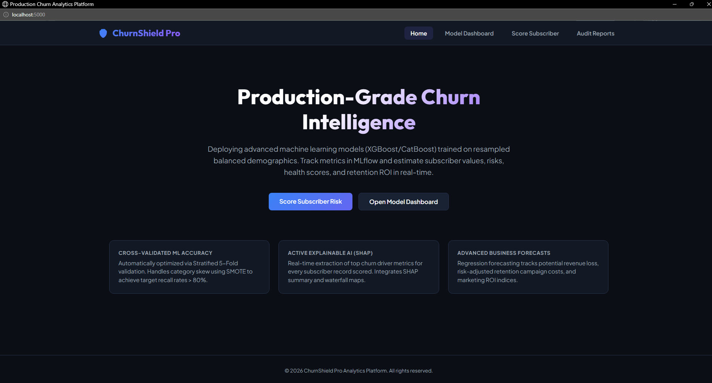

# Customer Churn Prediction & Retention Platform

An end-to-end production-grade machine learning platform and web application designed to predict telecom customer churn risk, forecast Customer Lifetime Value (CLV), segment users, generate automated business retention rules, and explain model decisions in real-time.
---

## 💼 The Business Problem Solved

In the subscription-based telecom sector, acquiring new customers costs up to **5-25x more** than retaining existing ones. Unidentified customer churn leads to massive revenue leakages.

This platform bridges the gap between raw data and commercial retention strategies by solving:

1. **Identifying High-Risk Customers**: Predicts which customers are likely to cancel their subscriptions *before* they actually do.
2. **Quantifying Financial Impact (CLV & Loss)**: Integrates ML classification (churn risk) and regression (Customer Lifetime Value) to estimate the **revenue at risk** for each customer.
3. **Optimizing Retention Spend (ROI)**: Calculates the cost of retention strategies (e.g., promotional discounts, support interventions) vs. the expected value saved, ensuring positive **Retention ROI** and preventing wasteful spending.
4. **Actionable Insights & Explainability (XAI)**: Uses SHAP value explanation to tell customer success teams *exactly* why a user is dissatisfied (e.g., high support ticket volumes, high monthly charges, contract type), allowing for customized, targeted winback programs.

---

## 🌟 Key Features

- **End-to-End ML Pipeline**: Automatic data ingestion, preprocessing, robust feature engineering (including interaction and behavioral features), hyperparameter tuning, model training, and evaluation.
- **Advanced Predictive Engines**:
  - **Churn Classifier**: Predicts probability of customer churn (supports Logistic Regression, XGBoost, CatBoost, etc., with SMOTE handles for class imbalance).
  - **CLV Regressor**: Forecasts the future value of the customer to prioritize retention efforts.
- **Explainable AI (XAI)**: Generates localized feature contributions (SHAP) to highlight exactly *why* a customer is flagged as high-risk.
- **Dynamic Business Rules**: Suggests retention strategies, calculated costs, expected ROI, and customer health scores.
- **Modern REST API**: Built on **FastAPI** with structured request/response schemas, fast endpoint execution, and prediction history logging.
- **Rich User Interface**: KPI metrics, interactive Chart.js analytics dashboard, single-customer score simulator, and historical prediction logs.

## 📷 Application Screenshots

Here are previews of the platform's rich user interface:

### 1. Analytics Dashboard & KPI Metrics


### 2. Subscriber Churn Risk Scorer & Simulator


---

## 📂 Repository Directory Structure

```text
customer-churn-prediction-mlops/
├── app/
│   ├── static/                    # Frontend assets
│   │   ├── app.js                 # Event listeners, API calls, dynamic form bindings
│   │   └── style.css              # Premium responsive styling (custom colors, Outfit font)
│   └── templates/                 # Jinja2 HTML templates
│       ├── dashboard.html         # Analytics dashboard with Chart.js
│       ├── index.html             # Application landing page
│       ├── predict.html           # Inference simulation simulator UI
│       └── reports.html           # Prediction logs view
│
├── backend/                       # Legacy/alternative server implementation
│   ├── app.py                     # Flask web server
│   ├── predict.py                 # Predict script
│   └── utils.py                   # Helper utilities
│
├── data/                          # Data store
│   ├── customer_churn.csv         # Raw customer dataset
│   └── processed_data.csv         # Engineered, scaled, and encoded dataframe
│
├── frontend/                      # Pure static UI development templates
│   ├── css/                       # Static CSS styles
│   ├── js/                        # UI scripts (app.js, charts.js)
│   ├── dashboard.html
│   ├── index.html
│   ├── predict.html
│   └── reports.html
│
├── models/                        # Serialized model and pipeline artifacts
│   ├── feature_pipeline.pkl       # Feature engineering transformer
│   ├── preprocessor.pkl           # Scaling and imputation pipeline
│   └── model.pkl                  # Model bundle (trained Classifier & Regressor)
│
├── reports/                       # Generated outputs and logs
│   ├── churn_report.csv           # Historical audit logs of scored predictions
│   └── shap_summary.png           # Global feature importance visualization
│
├── src/                           # Primary application source code
│   ├── api/
│   │   └── api.py                 # FastAPI web application endpoints and configuration
│   ├── explainability/
│   │   └── explain.py             # SHAP explainer wrappers and visualization tools
│   ├── feature_engineering/
│   │   └── feature_pipeline.py    # Custom pipeline step transformers
│   ├── ingestion/
│   │   └── ingestion.py           # Data loading utilities
│   ├── preprocessing/
│   │   └── preprocessing.py       # Imputers, encoders, and scaler definitions
│   ├── training/
│   │   └── train_pipeline.py      # Core pipeline orchestrating training, tuning, and MLflow logging
│   └── utils/
│       └── retention.py           # Financial metrics, Health Score, and ROI calculations
│
├── tests/                         # Test suites
│   ├── test_api.py                # FastAPI integration and endpoint tests
│   └── test_unit.py               # Unit tests for ML steps and retention rules
│
├── .github/
│   └── workflows/
│       └── mlops-pipeline.yaml    # Advanced CI/CD deployment pipeline
│
├── argocd/
│   └── application.yaml           # ArgoCD application sync definition
│
├── k8s/
│   ├── namespace.yaml             # Namespace config
│   ├── serviceaccount.yaml        # ServiceAccount config
│   ├── deployment.yaml            # Blue-Green Deployment strategy configuration
│   ├── service.yaml               # Active service routing configuration
│   ├── inference.yaml             # KServe InferenceService definition
│   └── kustomization.yaml         # Kustomize config manifest selector
│
├── monitoring/
│   └── prometheus/
│       └── prometheus.yml         # Prometheus metrics scrape endpoint config
│
├── app.py                         # Production server entry point (FastAPI launcher)
├── check_drift.py                 # Data drift validation script
├── compare_models.py              # Performance validation gatekeeping script
├── generate_data.py               # Dataset generation simulation script
├── dvc.yaml                       # DVC pipeline stages tracker
├── params.yaml                    # Configurable pipeline parameter store
├── predict.py                     # CLI & program production predictor wrapper
├── train.py                       # CLI training execution script
├── requirements.txt               # Project dependencies list
└── Dockerfile                     # Multi-stage Docker config for deployment
```

---

## ⚙️ Local Setup & Quick Start

### 1. Installation

Ensure you have Python 3.8+ installed. Clone the repository and install the dependencies:

```bash
pip install -r requirements.txt
```

### 2. Model Training & Preparation

To run the complete data pipeline (ingest, preprocess, optimize hyperparameters using Optuna, train models, log to MLflow, and generate SHAP plots):

```bash
python train.py
```

This generates:
- Serialized artifacts in `models/` (`feature_pipeline.pkl`, `preprocessor.pkl`, `model.pkl`)
- Visualization plots in `reports/` (`shap_summary.png`)
- Local MLflow runs tracking in `mlruns/`

### 3. Running the Server

Start the FastAPI application in reload mode:

```bash
python app.py
```
Open [http://localhost:5000](http://localhost:5000) in your web browser.

### 4. Running Tests

To run the full suite of unit and integration tests:

```bash
# Run unit tests on ML logic and rules
pytest tests/test_unit.py

# Run API endpoint integration tests
pytest tests/test_api.py
```

---

## 🐳 Containerized Deployment (Docker)

You can containerize the application to ensure consistency across environments.

### Build the Image
```bash
docker build -t customer-churn-platform .
```

### Run the Container
```bash
docker run -p 5000:5000 customer-churn-platform
```
Access the application at [http://localhost:5000](http://localhost:5000).

---

## 🔌 API Documentation

Once the server is running, you can access the interactive Swagger documentation at `http://localhost:5000/docs`.

### Core Endpoint: `POST /predict`

**Request Body Schema:**
```json
{
  "Gender": "Female",
  "Age": 34,
  "Tenure": 12,
  "MonthlyCharges": 85.5,
  "TotalCharges": 1026.0,
  "ContractType": "Month-to-month",
  "InternetService": "Fiber optic",
  "PaymentMethod": "Electronic check",
  "SupportTickets": 3,
  "AverageUsageHours": 140.5
}
```

**Response JSON Schema:**
```json
{
  "churn_probability": 0.6241,
  "risk_level": "High",
  "predicted_clv": 2450.0,
  "estimated_revenue_loss": 1026.0,
  "top_churn_drivers": [
    ["SupportTickets", 0.23],
    ["ContractType_Month-to-month", 0.18],
    ["MonthlyCharges", 0.12]
  ],
  "retention_recommendations": [
    "Schedule proactive account management call.",
    "Offer 15% discount for a 12-month contract commitment."
  ],
  "health_score": 38,
  "retention_cost": 150.0,
  "retention_roi": 5.84
}
```

---

## 🛠️ MLOps & GitOps Tooling Setup & Guidelines

This platform is configured for production-grade GitOps deployments, model versioning, monitoring, and automated pipelines.

### 1. Data Version Control (DVC) Setup
DVC is used to track model artifacts in AWS S3 rather than Git:
- **Initialize DVC**:
  ```bash
  dvc init
  ```
- **Add S3 Remote Storage**:
  ```bash
  dvc remote add -d myremote s3://churn-model-bucket-cicd-abhi/models
  ```
- **Track & Push Trained Models**:
  ```bash
  dvc add models/model.pkl models/preprocessor.pkl models/feature_pipeline.pkl
  dvc push
  ```

### 2. Kubernetes & KServe Orchestration (GitOps)
KServe is used to deploy models as autoscaling serverless inference endpoints:
- **Deploy ArgoCD Application**:
  Synchronize configurations directly using GitOps:
  ```bash
  kubectl apply -f argocd/application.yaml
  ```
- **Apply Manifests Manually**:
  ```bash
  kubectl apply -f k8s/namespace.yaml
  kubectl apply -f k8s/serviceaccount.yaml
  kubectl apply -k k8s/ # Applies Kustomization targeting deployments and KServe InferenceService
  ```

### 3. Blue-Green Deployment Strategy
To guarantee zero-downtime releases:
- The [deployment.yaml](k8s/deployment.yaml) defines both `customer-churn-blue` (active) and `customer-churn-green` (inactive/staging) environments.
- The [service.yaml](k8s/service.yaml) points to the active environment selector:
  ```yaml
  selector:
    app: customer-churn
    version: blue # Points to active environment, change to "green" for zero-downtime cutover
  ```
- During release, the CI/CD pipeline deploys code to the green environment, passes sanity testing, and updates the selector label in Git to trigger ArgoCD sync.

### 4. Advanced CI/CD Pipeline (GitHub Actions)
The [.github/workflows/mlops-pipeline.yaml](.github/workflows/mlops-pipeline.yaml) pipeline automates quality checks and updates deployments:
- **Data Drift Checks**: Executed via `check_drift.py` to ensure features match training distribution.
- **Model Validation (Gatekeeping)**: Running `compare_models.py` compares challenger metrics vs. champion model. Build fails if performance declines.
- **Image Push**: Builds and pushes Docker images to repository tag (`DOCKER_USERNAME/churn-app:commit-sha`).
- **Kustomize Edit**: Updates the image tag inside Kubernetes configuration files and pushes changes back to the `cicd` branch for automatic synchronization via ArgoCD.

### 5. Prometheus Metrics Scraper Setup
Live FastAPI traffic and prediction statistics are exported directly for Prometheus/Grafana:
- **Exporter Target**: Exposes standard text formatting metrics at `GET /prometheus`.
- **Metrics Collected**:
  - `api_requests_total`: Total number of REST API requests.
  - `api_request_latency_seconds`: Response latency histogram for predictability.
  - `predictions_total`: Number of churn prediction outcomes categorised by risk severity level.
- **Run Prometheus Locally**:
  ```bash
  prometheus --config.file=monitoring/prometheus/prometheus.yml
  ```

---

## 📄 License

This project is licensed under the MIT License - see the [LICENSE](file:///d:/Customer/LICENSE) file for details.
